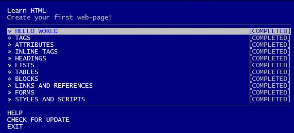

# Learnyouhtml
***
## Objetivo
El presente trabajo consta de practicar el lenguaje HTML a tráves de los siguientes ejericicios:
* Hello World
* Tags
* Attributes
* Inline-tags
* Headings
* Lists
* Tables
* Blocks
* Links and references
* Forms
* Styles and scripts

## Requerimientos
1. Instalar el programa `node.js`.
2. Desde de tu consola de tu computadora (cmd), ejecutar `npm install -g learnyouhtml`.
3. Luego ejecutar `learnyouhtml`y aparecera la siguiente imagen

4. Mediante esa guia, se seguirá un tutorial para cada ejercicio.
5. Para ingresar a cada ejercicio dar `enter`.
6. Para verificar cada ejercicio realizado ejecutar `learnyouhtml verify index.html`.
7. Para abrirlo en el navegador ejecutar `learnyouhtml run index.html`.
8. Por último para seguir con otro ejercicio ejercutar `learnyouhtml`.
